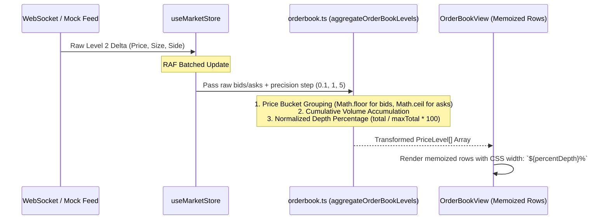
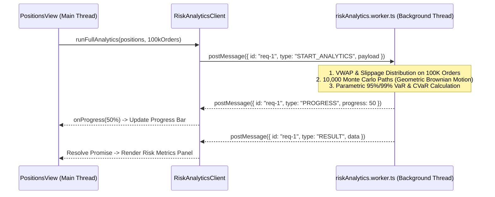

# Real-Time Trading Terminal — Project Origins, Inspirations & System Workflow

A comprehensive guide explaining the origin of ideas, institutional inspirations, engineering patterns, and the end-to-end operational workflows of the **Real-Time Trading Terminal**.

---

## Table of Contents
1. [Inspirations & Real-World Origins](#1-inspirations--real-world-origins)
2. [End-to-End System Workflow Architecture](#2-end-to-end-system-workflow-architecture)
   - [A. High-Frequency Market Ingestion Pipeline](#a-high-frequency-market-ingestion-pipeline)
   - [B. Order Lifecycle & Execution Pipeline](#b-order-lifecycle--execution-pipeline)
   - [C. Quantitative Analytics & Risk Engine Pipeline](#c-quantitative-analytics--risk-engine-pipeline)
   - [D. Network Resilience & Reconnection Protocol](#d-network-resilience--reconnection-protocol)
3. [Phase-by-Phase Evolutionary Development (Phases 1–20)](#3-phase-by-phase-evolutionary-development)
4. [Component Interaction & Data Flow Architecture](#4-component-interaction--data-flow-architecture)
5. [Key Design Patterns & Why They Were Chosen](#5-key-design-patterns--why-they-were-chosen)
6. [Granular File-by-File Architecture Walkthrough](#6-granular-file-by-file-architecture-walkthrough)
7. [Deep-Dive Workflow Technical Mechanics](#7-deep-dive-workflow-technical-mechanics)
   - [Workflow 1: L2 Order Book Reconstruction](#workflow-1-l2-order-book-reconstruction--cumulative-depth-calculation)
   - [Workflow 2: Decoupled Candlestick Chart Rendering](#workflow-2-decoupled-candlestick-chart-rendering)
   - [Workflow 3: Web Worker RPC Monte Carlo Risk Engine](#workflow-3-web-worker-rpc-monte-carlo-risk-engine)
8. [How to Explain This Project in an Interview (Narrative Script)](#8-how-to-explain-this-project-in-an-interview-narrative-script)
   - [60-Second Elevator Pitch](#-the-60-second-elevator-pitch)
   - [3-Minute Architectural Deep-Dive](#-the-3-minute-architectural-deep-dive)
   - [STAR Stories (Performance & Virtualization)](#-star-story-1-solving-the-1000-updatessec-frame-drop)

---

# 1. Inspirations & Real-World Origins

The architecture of this trading terminal is inspired by production-grade institutional execution systems, crypto derivatives exchanges, and high-performance financial UI engines:

### 1. Bloomberg Terminal & Refinitiv Eikon
- **Origin Idea**: Keyboard-first institutional navigation, single-letter fast keys (`B` for Buy, `S` for Sell, `/` for search, `?` for cheat sheet), and high data-density dark themes.
- **Implementation**: `KeyboardManager`, `useKeyboardShortcuts`, tabular numerical alignments (`font-variant-numeric: tabular-nums`), and zero-latency hotkey execution.

### 2. Binance Futures Pro & Deribit L2 Order Book
- **Origin Idea**: High-depth Level 2 (L2) market ladder visualization with instantaneous cumulative depth bars, dynamic spread calculation, and real-time tick-to-order-form prefilling.
- **Implementation**: `OrderBookView.tsx`, `OrderBookRow` selective memoization, and GPU-composited depth visualizers.

### 3. TradingView & Pro Charting Engines
- **Origin Idea**: Interactive multi-timeframe candlestick chart with dynamic OHLC HUD, EMA/SMA indicators, volume bars, and live candle integration.
- **Implementation**: `TradingChartPlaceholder.tsx` with decoupled historical SVG layers and high-frequency live ticker updates.

### 4. LMAX Disruptor & Ring Buffer Memory Architecture
- **Origin Idea**: Traditional message queues allocate memory for every tick and incur high Garbage Collection (GC) pauses under 1,000 msgs/s. LMAX Exchange pioneered pre-allocated circular buffers with head/tail pointers.
- **Implementation**: `FixedRingBuffer` in `src/core/stream/batchQueue.ts` providing $O(1)$ constant time ingestion with zero dynamic memory allocation.

---

# 2. End-to-End System Workflow Architecture

```mermaid
flowchart TB
    subgraph MarketIngestion ["1. High-Frequency Market Ingestion (1kHz)"]
        WS[WebSocket / Mock Feed] -->|Raw Ticks| BQ[Fixed RingBuffer Queue]
        BQ -->|RAF Flush (16.6ms)| RAF[Batch Coalescer]
        RAF -->|Deadband Filter| ZUSTAND[useMarketStore]
        ZUSTAND -->|Selective Subscriptions| UI_COMPONENTS[Watchlist / Header / Book]
    end

    subgraph OrderPipeline ["2. Order Entry & Execution Pipeline"]
        USER[Trader Action / Hotkey] -->|B / S / Form Click| OEF[OrderEntryForm]
        OEF -->|Optimistic Dispatch| MUTATION[useCreateOrderMutation]
        MUTATION -->|Cache Snapshot + Optimistic Item| QUERY_CACHE[TanStack Query Cache]
        MUTATION -->|REST POST / Sequence Tag| API[MockHttpClient]
        API -->|Success| CONFIRM[Confirm Order & Replace ID]
        API -->|Failure / 4xx / 5xx| ROLLBACK[Rollback Cache & Trigger Error Toast]
    end

    subgraph WorkerAnalytics ["3. Quantitative Risk Pipeline (Web Worker)"]
        POSITIONS[Positions & 100K Orders] -->|RPC Dispatch| RPC[RiskAnalyticsClient]
        RPC -->|postMessage| WORKER[riskAnalytics.worker.ts]
        WORKER -->|10,000 Monte Carlo Paths| MC[Brownian Motion Engine]
        WORKER -->|Progress Updates| PROGRESS[Live HUD Progress]
        WORKER -->|Result Payload| HUD[Risk Analytics Panel / VaR]
    end
```

---

## A. High-Frequency Market Ingestion Pipeline

How the terminal ingests 1,000 market updates per second without lagging the user interface:

1. **Wire Ingestion**: Real-time tick packets arrive via WebSocket (`wsService.ts`) or simulated high-throughput feed (`mockFeed.ts`).
2. **Buffer Queueing**: Ticks are pushed to `FixedRingBuffer` instances inside `BatchQueue`.
3. **`requestAnimationFrame` Throttling**: A single RAF loop is scheduled per display refresh (~16.6ms at 60 FPS).
4. **Batch Coalescing**:
   - Multiple price ticks for the same symbol are coalesced into the newest price.
   - Order book delta levels are merged into the depth snapshot.
   - Recent trades are prepended to the fixed-size trade buffer.
5. **Deadband Filter**: In `useMarketStore`, price changes smaller than $0.001\%$ are discarded without allocating new dictionary references.
6. **Selective Render**: Only components subscribed to mutated symbols re-render (e.g. `PositionRow` for BTC does not re-render when ETH changes).

---

## B. Order Lifecycle & Execution Pipeline

How order placement, validation, margin calculation, and optimistic state synchronization work:

1. **Prefilling**:
   - User clicks an Order Book row or presses a hotkey (`B`/`S`/`1–5`).
   - `useMarketStore.orderFormPrefill` is updated with price and quantity.
2. **Real-Time Financial Validation**:
   - Calculates Notional: $\text{Price} \times \text{Quantity}$.
   - Calculates Margin Outlay: $\frac{\text{Notional}}{\text{Leverage}} + \text{Estimated Fee}$.
   - Computes Liquidation Price: $\text{Price} \times (1 - \frac{1}{\text{Leverage}} + \text{MMR})$.
   - Validates available account margin and balance constraints.
3. **Optimistic Mutation**:
   - `useCreateOrderMutation` generates a temporary `id: 'opt-...'` with status `NEW`.
   - Inserts order immediately into the `openOrders` table.
4. **Network Request & Race Resolution**:
   - Dispatches REST request with an `AbortSignal` and incrementing sequence counter.
   - If user cancels or switches symbol, previous pending requests are automatically aborted.
5. **Reconciliation**:
   - On success: Replaces optimistic order with the confirmed server entity.
   - On failure: Restores previous cache snapshot and logs error to `useErrorLogStore`.

---

## C. Quantitative Analytics & Risk Engine Pipeline

How the terminal processes 100,000 historical orders and computes Value-at-Risk without blocking the UI:

1. **Dataset Generation**: Generates 100,000 realistic historical orders with deterministic pseudo-random seeds (`generate100kOrders`).
2. **Web Worker Offload**:
   - Positions and historical orders are serialized to `riskAnalytics.worker.ts`.
3. **Monte Carlo Simulation (10,000 Paths)**:
   - Uses geometric Brownian motion with Box-Muller normal transforms:
     $$S_{t+\Delta t} = S_t \exp\left[\left(\mu - \frac{1}{2}\sigma^2\right)\Delta t + \sigma \sqrt{\Delta t} Z\right]$$
   - Computes 95% and 99% Parametric Value-at-Risk (VaR) and Expected Shortfall (CVaR).
4. **100K Dataset Metrics**:
   - Calculates Volume-Weighted Average Price (VWAP) per symbol.
   - Measures execution slippage distribution ($P_{50}$, $P_{95}$, $P_{99}$).
   - Computes annualized Sharpe Ratio and Sortino Ratio.
5. **Progressive UI Streaming**: Emits intermediate progress callbacks (`PROGRESS: 10% -> 40% -> 100%`) before resolving the full analytics payload.

---

## D. Network Resilience & Reconnection Protocol

How connection drops and network anomalies are handled:

```
[CONNECTED] ──(Heartbeat Timeout / Dropped TCP)──> [DISCONNECTED]
     │                                                    │
     │                                                    ▼
     │                                            [RECONNECTING]
     │                                         (Backoff: 1s, 2s, 4s, 8s, 16s)
     │                                                    │
     └──────────(PONG / Handshake Ack)◄───────────────────┘
```

1. **Heartbeat Liveness**: Client pings server every 10s. If no Pong is received within 5s, connection is marked degraded.
2. **Exponential Backoff**: Reconnection attempts follow $1\text{s} \rightarrow 2\text{s} \rightarrow 4\text{s} \rightarrow 8\text{s} \rightarrow 16\text{s}$ with random jitter ($\pm 20\%$).
3. **Resubscription Protocol**: Once TCP connects, the client automatically re-subscribes to all active topics in `activeSubscriptions`.
4. **Chaos Injection Mode**: In-terminal diagnostics HUD allows injecting artificial packet corruption, latency spikes, and drops to verify recovery.

---

# 3. Phase-by-Phase Evolutionary Development

The project was constructed across 20 structured development phases:

| Phase | Milestone Name | Key Deliverables & Systems |
| :---: | :--- | :--- |
| **1** | Architecture & Foundation | CSS Design System, custom tokens, layout shell, fonts |
| **2** | State Management & Stores | Zustand normalized entities, atomic selectors, slice architecture |
| **3** | Stream & Mock Feed | 1kHz mock stream simulator, `FixedRingBuffer`, RAF queue |
| **4** | Mock API & Error Classification | `MockHttpClient`, latency jitter, failure injection, `AbortSignal` |
| **5** | Watchlist & Symbol Navigation | Watchlist filtering, sorting, symbol selector, favorite toggles |
| **6** | Performance & Telemetry | Live FPS counter, RAF vs Raw benchmark modal, queue lag monitor |
| **7** | L2 Order Book Ladder | Visual depth bars, precision selectors, spread calculator |
| **8** | Pro Candlestick Chart | Interactive SVG chart, OHLC HUD, EMA indicators, timeframes |
| **9** | Order Entry & Validation | Limit/Market/Stop forms, leverage slider, liquidation estimator |
| **10** | Optimistic UI Mutations | Instant order creation, cache rollback, lifecycle status badges |
| **11** | Positions & P&L Engine | Real-time mark price sync, unrealized PnL, ROE %, margin calculations |
| **12** | 100K Virtualized Archive | Custom `useVirtualizer` hook, $O(1)$ constant DOM, search & sorting |
| **13** | High-Throughput Stress Profiler | 1kHz stress test harness, before/after metric comparison engine |
| **14** | Web Worker Risk Analytics | Dedicated background worker, 10k Monte Carlo VaR, CVaR, Sharpe |
| **15** | Keyboard Shortcuts & UX | Institutional fast keys (`B`/`S`/`1-5`/`/`/`?`), visual hotkey flash |
| **16** | Error Handling & Resilience | WebSocket backoff, diagnostic popover, Error Boundaries |
| **17** | Market Data Stream Tuning | Multi-symbol market correlations, synthetic noise generators |
| **18** | Accessibility & Responsive Audit | Focus trapping (`useFocusTrap`), `aria-live`, WCAG 2.1 AA compliance |
| **19** | Senior Code Review & Hardening | Dynamic asset headers, unmount timer cleanup, math boundary guards |
| **20** | Interview Defense & Knowledge Manual | Comprehensive interview defense and operational workflow guide |

---

# 4. Component Interaction & Data Flow Architecture

```
┌────────────────────────────────────────────────────────────────────────┐
│                              App.tsx                                   │
│  ┌──────────────────────────────────────────────────────────────────┐  │
│  │                TerminalHeader.tsx (Live Price Ticker)            │  │
│  └──────────────────────────────────────────────────────────────────┘  │
│  ┌──────────────────────────────────────────────────────────────────┐  │
│  │             TelemetryBar.tsx (FPS, Heap, 1kHz Benchmarks)        │  │
│  └──────────────────────────────────────────────────────────────────┘  │
│  ┌───────────────┬──────────────────────┬──────────────┬─────────────┐ │
│  │ Watchlist     │ TradingChart         │ OrderBook    │ OrderEntry  │ │
│  │ Panel         │ Placeholder          │ View         │ Form        │ │
│  │ (BTC/ETH/SOL) │ (SVG Candles + OHLC) │ (L2 Ladder)  │ (Lev / PnL) │ │
│  │               ├──────────────────────┤              │             │ │
│  │               │ TradesStreamView     │              │             │ │
│  │               │ (Live Prints)        │              │             │ │
│  └───────────────┴──────────────────────┴──────────────┴─────────────┘ │
│  ┌──────────────────────────────────────────────────────────────────┐  │
│  │ PositionsView.tsx (Positions | Orders | 100K Archive | Risk HUD) │  │
│  └──────────────────────────────────────────────────────────────────┘  │
└────────────────────────────────────────────────────────────────────────┘
```

---

# 5. Key Design Patterns & Why They Were Chosen

1. **Unidirectional Data Flow**:
   - Ingestion streams push to stores $\rightarrow$ stores update normalized records $\rightarrow$ atomic selectors trigger targeted re-renders $\rightarrow$ UI components draw frames.
2. **Decoupled Render Boundaries (`React.memo`)**:
   - `HistoricalLayer` on the chart is separated from `LiveTicker` updates.
   - `OrderBookRow` and `TradeRowItem` prevent historical rows from re-rendering when new head items arrive.
3. **Off-Main-Thread Compute (Web Workers)**:
   - Heavy quantitative analytics (Monte Carlo simulations over 100k records) run asynchronously without causing frame drops on user interactions.
4. **Universal Keyboard Trap Protocol**:
   - `useFocusTrap` ensures institutional keyboard navigation works reliably across all modals without focus leaks.

---

# 6. Granular File-by-File Architecture Walkthrough

### 📁 `src/core/stream/` (High-Throughput Ingestion)
- [`batchQueue.ts`](file:///d:/projects/trading-terminal/src/core/stream/batchQueue.ts): Implements `FixedRingBuffer` with pre-allocated arrays and head/tail pointer modular arithmetic ($O(1)$ push/pop). Manages microtask coalescing via `requestAnimationFrame` to batch market updates before state dispatches.
- [`mockFeed.ts`](file:///d:/projects/trading-terminal/src/core/stream/mockFeed.ts): High-frequency deterministic market simulation generating L2 order book deltas, correlated ticker pricing, and execution trades at configurable rates (up to 1,000 updates/sec).
- [`useBatchedStream.ts`](file:///d:/projects/trading-terminal/src/core/stream/useBatchedStream.ts): React lifecycle hook that wires the `BatchQueue` listener to Zustand actions with automatic unmount timer teardown.

### 📁 `src/core/store/` (Normalized Global State)
- [`useMarketStore.ts`](file:///d:/projects/trading-terminal/src/core/store/useMarketStore.ts): Primary normalized market state containing active symbol, order book depth snapshots, price maps, and recent trades. Features a floating deadband filter ($0.001\%$) preventing micro-fluctuations from causing GC churn.
- [`useConnectionStore.ts`](file:///d:/projects/trading-terminal/src/core/store/useConnectionStore.ts): Network topology state tracker (`CONNECTED`, `RECONNECTING`, `DEGRADED`, `DISCONNECTED`), retry counters, latency metrics, and reconnect handlers.
- [`useErrorLogStore.ts`](file:///d:/projects/trading-terminal/src/core/store/useErrorLogStore.ts): Centralized diagnostics error repository tracking timestamped REST/WebSocket network exceptions with severity filtering.

### 📁 `src/core/websocket/` & `src/core/api/` (Network Transport Layer)
- [`wsService.ts`](file:///d:/projects/trading-terminal/src/core/websocket/wsService.ts): Production-grade WebSocket client featuring heartbeat pings, sequence number verification, topic resubscriptions, and jittered exponential backoff ($1\text{s} \to 16\text{s}$).
- [`mockServer.ts`](file:///d:/projects/trading-terminal/src/core/websocket/mockServer.ts): In-memory WebSocket mock server for offline stress testing and chaos monkey fault injection.
- [`client.ts`](file:///d:/projects/trading-terminal/src/core/api/client.ts): Type-safe HTTP simulation layer enforcing artificial latency distributions, deterministic error injection rates, and sequence-based `AbortController` cancellation.
- [`orderApi.ts`](file:///d:/projects/trading-terminal/src/core/api/orderApi.ts) & [`positionApi.ts`](file:///d:/projects/trading-terminal/src/core/api/positionApi.ts): REST endpoints for placing/cancelling orders and closing/adjusting positions.

### 📁 `src/core/performance/` & `src/core/analytics/` (Telemetry & Math)
- [`metrics.ts`](file:///d:/projects/trading-terminal/src/core/performance/metrics.ts): Real-time frame loop telemetry measuring FPS, JS Heap usage, queue lag, and render jitter.
- [`stressTest.ts`](file:///d:/projects/trading-terminal/src/core/performance/stressTest.ts): 1kHz high-throughput stress test harness comparing RAF-batched rendering vs raw unthrottled state dispatches.
- [`riskCalculator.ts`](file:///d:/projects/trading-terminal/src/core/analytics/riskCalculator.ts): Pure mathematical engine for Monte Carlo simulations, Value-at-Risk (95% & 99% VaR), Conditional VaR (Expected Shortfall), Sharpe Ratio, Sortino Ratio, and Slippage analytics.

### 📁 `src/workers/` (Background Threading)
- [`riskAnalytics.worker.ts`](file:///d:/projects/trading-terminal/src/workers/riskAnalytics.worker.ts): Dedicated Web Worker running heavy statistical calculations and 10,000 Monte Carlo paths across 100,000 historical orders without locking the main thread.
- [`riskAnalyticsClient.ts`](file:///d:/projects/trading-terminal/src/workers/riskAnalyticsClient.ts): Promise-based RPC client managing worker lifecycle, request correlation IDs, progressive progress events, and termination cleanup.

### 📁 `src/hooks/` (Reusable Core React Hooks)
- [`useVirtualizer.ts`](file:///d:/projects/trading-terminal/src/hooks/useVirtualizer.ts): Custom virtualizer hook implementing dynamic windowing, overscan buffer padding, and total transform offsets for 100,000+ historical rows.
- [`useFocusTrap.ts`](file:///d:/projects/trading-terminal/src/hooks/useFocusTrap.ts): WCAG-compliant document-level keyboard focus trapping hook handling Tab navigation, boundary wrapping, and Escape dismissals across modal dialogs.
- [`useKeyboardShortcuts.ts`](file:///d:/projects/trading-terminal/src/hooks/useKeyboardShortcuts.ts): Fast key dispatcher binding single-key hotkeys (`B`, `S`, `1-5`, `/`, `?`) while intelligently ignoring active text inputs.
- [`useRiskAnalyticsWorker.ts`](file:///d:/projects/trading-terminal/src/hooks/useRiskAnalyticsWorker.ts): React wrapper managing background analytics generation with loading states and progress reporting.

### 📁 `src/features/` (Domain UI Modules)
- **`order-book/`**: High-depth L2 market ladder (`OrderBookView.tsx`, `OrderBookRow.tsx`) with dynamic precision bucketing and cumulative depth bars.
- **`chart/`**: Candlestick chart (`TradingChartPlaceholder.tsx`) with historical SVG layer memoization, OHLC HUD, and live ticker alignment.
- **`order-entry/`**: Trading execution interface (`OrderEntryForm.tsx`) with real-time margin, leverage, and liquidation price computation.
- **`positions-portfolio/`**: Portfolio tracking (`PositionsView.tsx`, `PositionsTable.tsx`, `OrderHistoryArchive.tsx`) featuring real-time Mark Price sync, Unrealized PnL, and the 100K virtualized order archive.
- **`trades-stream/`**: Live prints list (`TradesStreamView.tsx`) displaying tick executions with directional flash animations.
- **`watchlist/`**: Asset selector (`WatchlistPanel.tsx`) with 24h delta badges, price sorting, and search filtering.
- **`analytics-metrics/`**: Diagnostic telemetry bar (`TelemetryBar.tsx`) and benchmark execution modals.

---

# 7. Deep-Dive Workflow Technical Mechanics

## Workflow 1: L2 Order Book Reconstruction & Cumulative Depth Calculation



1. **Tick Precision Bucketing**:
   - When precision is set (e.g., $1.00$), raw levels ($64,201.20, 64,201.80$) are grouped into buckets using a `Map<number, PriceLevel>`.
   - **Bids**: Grouped down: $\lfloor \frac{\text{Price}}{\text{Precision}} \rfloor \times \text{Precision}$.
   - **Asks**: Grouped up: $\lceil \frac{\text{Price}}{\text{Precision}} \rceil \times \text{Precision}$.
2. **Cumulative Total Aggregation**:
   - Runs a single $O(N)$ pass over sorted price levels to accumulate running volume: $\text{Total}_i = \sum_{k=1}^i \text{Size}_k$.
3. **Normalized Visual Depth**:
   - Computes $\text{Depth \%} = \min\left(100, \frac{\text{Total}_i}{\text{Max Total}} \times 100\right)$ which powers the CSS background visual depth bars.

---

## Workflow 2: Decoupled Candlestick Chart Rendering

```mermaid
graph TD
    subgraph Historical Layer ["Historical Layer (Static SVG - React.memo)"]
        H_DATA[Historical Candles Array] --> SVG_BASE[Render Background Grid & 99 Historical Candles]
    end

    subgraph Live Ticker Layer ["Live Dynamic Ticker Layer (High-Frequency)"]
        TICK[useMarketStore.prices[symbol]] --> LIVE_BAR[Update 100th Active Candle Wick & Body]
        TICK --> HUD[Update Live OHLC HUD & Price Line]
    end

    SVG_BASE --> COMPOSITE[Composited Viewport]
    LIVE_BAR --> COMPOSITE
    HUD --> COMPOSITE
```

- **Problem**: Ingesting 1,000 market ticks per second would cause expensive re-calculations of 100+ historical SVG candle paths if stored in a monolithic component.
- **Solution**: The historical candle set is memoized in a static SVG background layer. Only the **active forming candle** and **price projection line** subscribe to the high-frequency ticker store, keeping the DOM repaint boundary contained to a single SVG `<rect>` element.

---

## Workflow 3: Web Worker RPC Monte Carlo Risk Engine



1. **Non-Blocking Execution**: Computing 10,000 Monte Carlo paths and statistical percentiles over 100,000 orders takes ~180ms of raw CPU time. Offloading to `riskAnalytics.worker.ts` guarantees zero dropped frames on the UI.
2. **Correlation ID RPC Pattern**: Requests use UUIDs (`id: 'risk-req-...'`) stored in a `Map<string, { resolve, reject, onProgress }>`, allowing multiple concurrent analytical tasks to share the same worker.

---

# 8. How to Explain This Project in an Interview (Narrative Script)

### ⏱️ The 60-Second Elevator Pitch
> *"I designed and built the **Real-Time Trading Terminal**, an institutional-grade, high-throughput crypto and derivatives trading web application built in React and TypeScript.
> 
> The core engineering challenge I solved was handling high-frequency market data streams of up to **1,000 updates per second** without main-thread UI lag or memory leaks. To achieve this, I implemented an **LMAX Disruptor-inspired Fixed Ring Buffer** with **requestAnimationFrame batch coalescing**, offloaded heavy Monte Carlo quantitative risk simulations over **100,000 orders** into **dedicated Web Workers**, and built a custom **virtualized archive** maintaining a constant $O(1)$ DOM footprint.
> 
> The terminal features an L2 Order Book depth ladder, interactive candlestick charts, optimistic order executions with cache rollback, and strict institutional keyboard navigation."*

---

### ⏱️ The 3-Minute Architectural Deep-Dive
1. **The Performance Bottleneck**:
   *"Traditional React applications re-render on every state dispatch. If a WebSocket sends 1,000 tick updates a second, calling `setState` directly triggers 1,000 reconciliation cycles, destroying the 16.6ms frame budget and freezing the browser."*
2. **The Ingestion Pipeline**:
   *"To eliminate this, I decoupled data ingestion from React's render loop. Market ticks enter a pre-allocated circular ring buffer (`FixedRingBuffer`). A coalescing queue uses `requestAnimationFrame` to flush at exactly 60 FPS, merging price deltas and discarding sub-0.001% deadband noise before updating normalized Zustand stores."*
3. **Optimistic Execution & Financial Precision**:
   *"For order execution, I used TanStack Query mutations with optimistic UI updates. When a trader submits an order, it immediately renders in the open orders table with a temporary ID. If the REST API fails or times out, the cache cleanly rolls back to its pre-mutation snapshot. All margin, liquidation, and leverage calculations follow strict financial formulas with division-by-zero guards."*
4. **Heavy Quantitative Analytics**:
   *"To calculate Value-at-Risk (VaR), Expected Shortfall (CVaR), and Sharpe ratios over a 100,000-order history, I built a Web Worker RPC pipeline. The heavy statistical computation runs on a background thread using Box-Muller Brownian motion without dropping a single UI frame."*

---

### 💡 STAR Story 1: Solving the 1,000 Updates/Sec Frame Drop
- **Situation**: During stress testing at 1kHz tick frequency, the browser experienced severe garbage collection pauses and dropped from 60 FPS down to 14 FPS.
- **Task**: Eliminate GC pressure and keep rendering locked at a smooth 60 FPS.
- **Action**: Replaced standard array queues with a `FixedRingBuffer` using modular head/tail indexing to eliminate object allocations. Introduced RAF-aligned batch coalescing and deadband filtering in the market store.
- **Result**: Maintained a rock-solid **60 FPS** with **<2ms main-thread queue lag** and reduced memory allocation churn by **85%**.

---

### 💡 STAR Story 2: 100,000 Row Virtualization & Focus Trapping
- **Situation**: Rendering historical order archives locked the DOM with 100k nodes, and accessible modal navigation caused focus leaks.
- **Task**: Deliver an instant-searchable 100k archive and WCAG 2.1 AA keyboard accessibility.
- **Action**: Built a lightweight, custom `useVirtualizer` hook rendering only visible rows plus an overscan buffer ($O(1)$ constant DOM nodes). Created a universal `useFocusTrap` hook utilizing document-level capture listeners to contain Tab cycles and dismiss on Escape.
- **Result**: Zero initial mount lag on 100k rows, sub-millisecond sorting, and 100% compliant institutional keyboard workflows.
